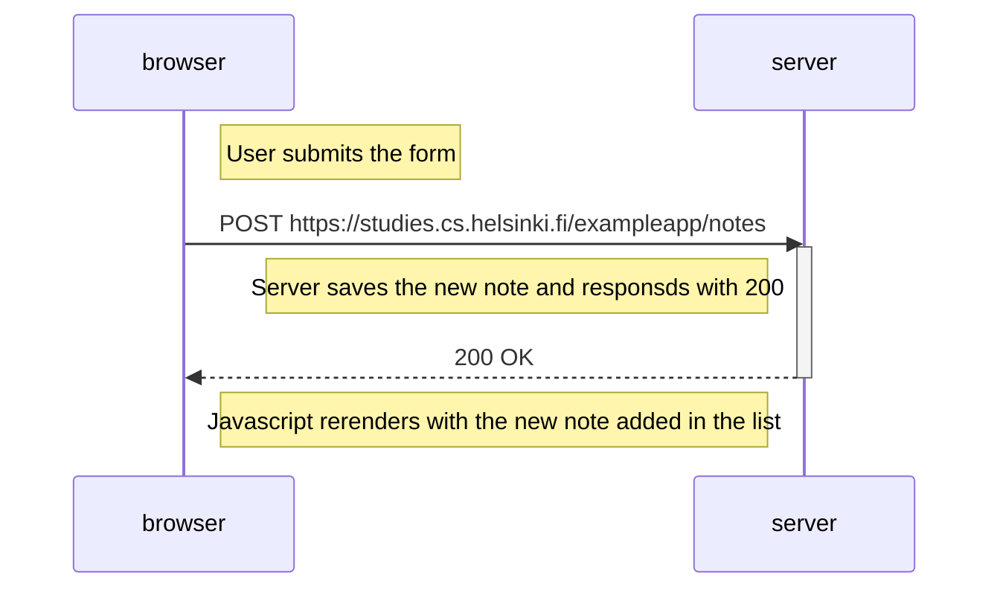

```mermaid
sequenceDiagram
    participant browser
    participant server

    Note right of browser: User submits the form

    browser->>server: POST https://studies.cs.helsinki.fi/exampleapp/notes
    activate server
    Note left of server: Server saves the new note and responsds with 200

    server-->>browser: 200 OK
    deactivate server

    Note right of browser: Javascript rerenders with the new note added in the list

```