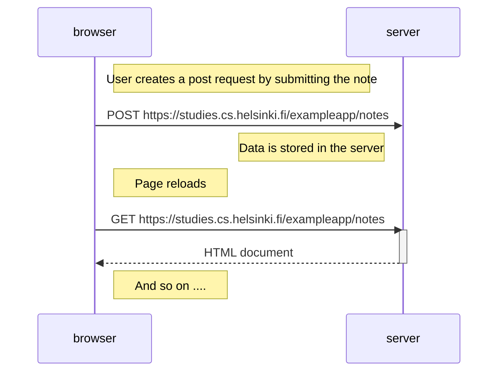

```mermaid
sequenceDiagram
    participant browser
    participant server

    Note right of browser: User creates a post request by submitting the note

    browser->>server: POST https://studies.cs.helsinki.fi/exampleapp/notes

    Note left of server: Data is stored in the server

    Note right of browser: Page reloads

    browser->>server: GET https://studies.cs.helsinki.fi/exampleapp/notes
    activate server
    server-->>browser: HTML document
    deactivate server

    Note right of browser: And so on ....
```